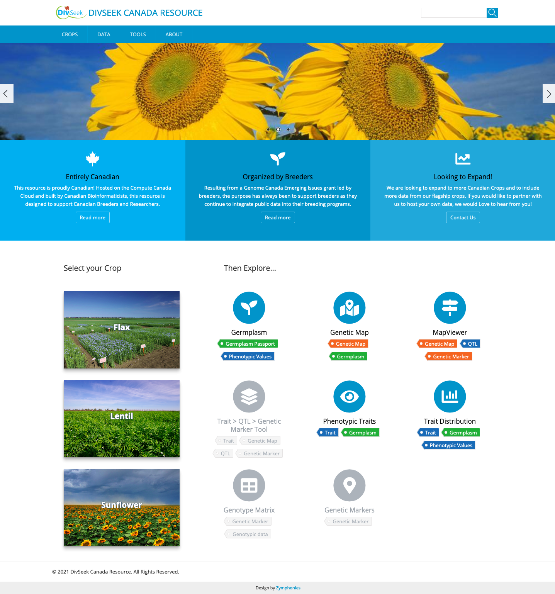

# DivSeek Canada Theme

This theme is being used on the divseekcanada.ca Tripal site for support of multiple crops focused on plant breeding and variation data research.

## Dependencies
 - Drupal 7.x
 - [Lexus Zymponies Theme](https://www.drupal.org/project/lexus_zymphonies_theme)

## WARNING: Currently crops/tools on front page are hard-coded. 
**Unless using this for the main DivSeek Canada portal, make sure to create a [Drupal sub-theme](https://www.drupal.org/docs/7/theming/creating-a-sub-theme) to support your own species. Specifically, you will want to focus your changes on the `templates/page--front.tpl.php`. Note: make sure to match the HTML elements and attributes when adding new crops and tools as these are used in the javascript selectors.**

